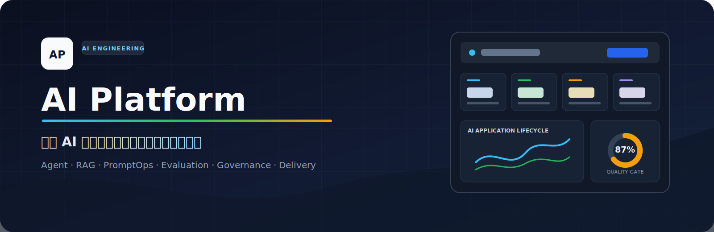
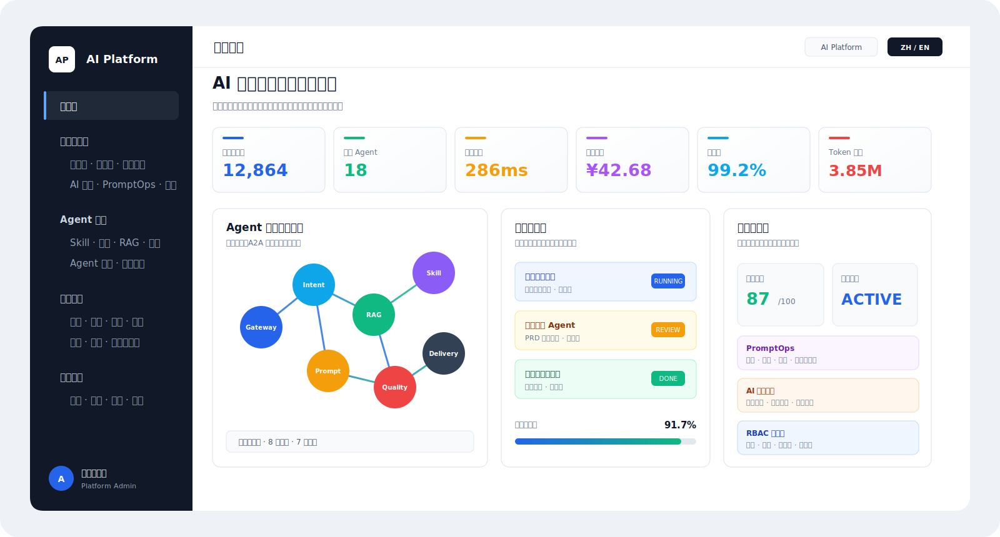
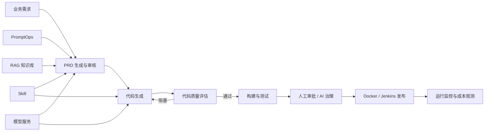
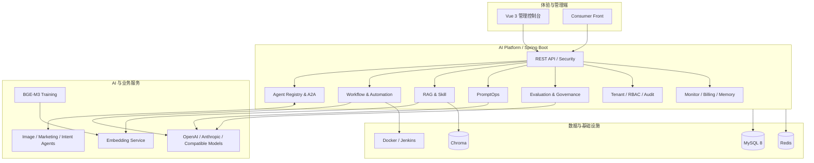

<div align="center">
  

  <p>
    <strong>统一管理 Agent、知识库、提示词、评测治理、自动化交付、多租户权限与成本观测。</strong>
  </p>

  <p>
    
    
    
    
    
    
  </p>

  <p>
    <a href="#核心能力">核心能力</a> ·
    <a href="#系统架构">系统架构</a> ·
    <a href="#快速启动">快速启动</a> ·
    <a href="#项目状态">项目状态</a> ·
    <a href="#项目文档">项目文档</a>
  </p>
</div>

---

## 平台概览

AI Platform 是一个面向团队的 **AI 应用工程与治理平台**。它把分散的 Agent、RAG、Prompt、评测、质量门禁、部署和权限能力组织进同一套工作流，帮助开发者观察 AI 应用如何注册、协作、评测、交付和持续运营。

项目当前处于 **功能主体完成，持续迭代与环境联调中** 的阶段，适合用于：

- 研究和实践 AI Platform、AgentOps、PromptOps 与 AI DevOps。
- 构建企业内部 AI 能力底座或管理控制台。
- 演示从需求、代码生成到质量评估和部署发布的完整链路。
- 学习多租户、RBAC、RAG、模型接入与成本治理的工程实现。



> 上图依据当前管理端的导航、工作台、Agent 图谱和治理页面绘制，用于概览产品结构，不代表实时运行数据。

### 这是什么

- 一套覆盖 AI 应用全生命周期的工程平台。
- 一个连接 Agent、知识、提示词、评测、交付和运营观测的统一工作台。
- 一个持续演进、强调真实工程边界的开源项目。

### 它不是什么

- 不是只提供对话窗口的 Chat UI。
- 不是只有 Agent 增删改查的管理后台。
- 不是已经完成全部生产环境验证的商业云服务。

## 核心能力

| 能力域 | 解决的问题 | 主要能力 |
| --- | --- | --- |
| **Agent 生命周期与协作** | 统一管理 Agent 的接入、运行与协作关系 | 动态注册、心跳、上下线、版本管理、A2A 通信、调用图谱、工作流编排 |
| **RAG 知识库** | 管理文档切分、向量化和知识检索链路 | Chroma 集合、文档块查看、Embedding 模型选择、固定切分、混合切分演进 |
| **PromptOps 与 Skill** | 让提示词和能力配置具备可追踪的工程流程 | Prompt 版本、评测、AI 优化、发布、运行时关联、Skill 管理与上下文注入 |
| **评测与 AI 治理** | 在模型产出进入后续流程前建立质量与风险控制 | 数据集导入、模拟数据、Agent 测评、代码质量评分、质量门禁、人工审核、治理策略 |
| **自动化交付** | 串联从需求到代码和部署的交付过程 | PRD 生成、代码生成、产物预览、构建测试、Docker/Jenkins 配置与执行记录 |
| **多租户与权限** | 隔离不同团队的数据与操作边界 | Tenant Context、RBAC、权限码、菜单树、成员与角色、租户数据隔离、审计日志 |
| **模型与运营观测** | 观察模型使用、系统运行和资源成本 | 模型目录、调用监控、Token 统计、用户成本、告警、用户记忆、BGE-M3 训练入口 |

## 典型工作流



平台并不要求所有项目都经过完整链路。Agent 管理、RAG、PromptOps、数据集评测和自动化交付可以按团队场景独立使用。

## 系统架构



### 技术选型

| 层级 | 技术 | 在平台中的职责 |
| --- | --- | --- |
| Backend | Java 21、Spring Boot 3.2.4、Spring AI | API、领域服务、模型接入、流式输出和任务编排 |
| Security & Data | Spring Security、JWT、MyBatis-Plus | 认证授权、租户上下文、权限校验和数据访问 |
| Frontend | Vue 3、Vite 5、Element Plus、Pinia、ECharts | 管理控制台、图谱、评测、治理和运营可视化 |
| Storage | MySQL 8、Redis、Chroma | 业务数据、短时状态与记忆、向量知识库 |
| AI Services | Embedding Service、BGE-M3 Training、独立 Agent | 向量化、模型训练和场景化 Agent 能力 |
| Delivery | Docker、Jenkins | 自动化构建、部署执行与运行记录 |

## 项目结构

```text
AIPlatform/
├── backend/             # Spring Boot 核心平台与数据库脚本
├── front/               # Vue 3 管理控制台
├── consumer-front/      # 面向使用者的前端入口
├── embedding-service/   # Embedding 服务
├── bge-m3-training/     # BGE-M3 数据准备与训练脚本
├── image-agent/         # 图像处理 Agent
├── marketing-agent/     # 营销分析 Agent
├── intent-agent/        # 意图识别 Agent
├── deploy/              # 部署配置与环境示例
├── docs/                # 架构、需求、测试与进度文档
└── start-all.ps1        # Redis / Chroma / Embedding 本地启动辅助脚本
```

## 快速启动

### 环境要求

- JDK 21 与 Maven 3.9+
- Node.js 20+
- MySQL 8.0
- Redis
- 可选：Chroma、Python 3.10+、Docker、Jenkins、CUDA/GPU

### 1. 准备数据库

创建 `ai_platform` 数据库，执行基础初始化脚本，并按本地环境更新后端配置：

```bash
mysql -u root -p ai_platform < backend/sql/init.sql
```

项目中的领域 Schema 与启动初始化器会补充自动化流水线、RAG、PromptOps、治理和多租户相关结构。升级已有数据库前，请先备份数据并检查 `backend/sql/` 下对应迁移脚本。

### 2. 启动基础 AI 服务（可选）

Windows：

```powershell
.\start-all.ps1
```

Linux / macOS / Git Bash：

```bash
./start-services.sh
```

脚本用于辅助启动 Redis、Chroma 和 Embedding Service；也可以通过参数跳过不需要的服务。

### 3. 启动后端

```bash
cd backend
mvn spring-boot:run
```

后端默认地址：`http://localhost:8080`

### 4. 启动管理端

```bash
cd front
npm install
npm run dev
```

管理端默认地址：`http://localhost:3000`

> 账号、密码、模型密钥和数据库凭据请在本地配置中自行设置，不要提交到仓库。

## 项目状态

| 状态 | 范围 |
| --- | --- |
| **已完成** | Agent 管理与图谱、自动化流水线、Skill、基础 RAG、PromptOps、代码质量评估、AI 治理、多租户与 RBAC、成本和运营页面主体 |
| **持续完善** | RAG 混合切分、治理策略与审批闭环、真实扫描工具接入、按钮级权限和产品体验 |
| **待环境验证** | 后端完整 Maven 测试、Redis 记忆压缩、Chroma 真实入库、Docker/Jenkins 端到端部署、BGE-M3 GPU 训练 |

当前已记录的验证结果：

- 前端生产构建通过。
- 租户迁移脚本和关键表 `tenant_id` 覆盖已完成静态检查。
- 后端完整测试仍需要具备 JDK/Maven 的环境执行。

## 路线图

- [ ] 完成后端测试与核心链路回归。
- [ ] 收口 RAG 混合切分主流程和评测验证。
- [ ] 完成 Docker / Jenkins / Redis / Chroma 环境联调。
- [ ] 加强治理策略、人工审批和质量证据链。
- [ ] 补充公开演示数据、产品截图和部署示例。

## 项目文档

| 文档 | 说明 |
| --- | --- |
| [产品需求文档](PRD.md) | 平台版本、Agent、工作流、评测等产品设计 |
| [系统架构设计](docs/architecture-v2.md) | Agent 状态、A2A、Spring AI 和部署架构 |
| [Agent 动态注册设计](docs/superpowers/specs/2026-04-24-agent-registry-design.md) | 注册、心跳、事件和编排方案 |
| [Ubuntu 部署文档](docs/deployment-ubuntu.md) | 环境、中间件、应用和 Nginx 部署说明 |
| [开发规范](docs/development-standard.md) | 数据库、Java、Vue、API、安全与 Git 规范 |
| [集成测试报告](docs/Integration-Test-Report-v3.0.md) | Agent 注册、心跳、A2A 和调用链验证 |
| [最新开发进度](docs/multitenant-rbac-progress.md) | 多租户、权限、治理和平台增量记录 |

## 参与贡献

欢迎通过 Issue 或 Pull Request 参与项目。提交前建议：

1. 阅读 [开发规范](docs/development-standard.md)。
2. 保持改动边界清晰，并补充对应测试或验证记录。
3. 不提交密钥、密码、本地模型、大型训练产物或运行数据。

如果这个项目对你的 AI 工程实践有帮助，欢迎在 [GitHub](https://github.com/jl1094000600/AiPlatform) 点一个 Star，持续关注后续迭代。

## License

项目当前按 MIT License 对外说明，正式许可文本将在独立 `LICENSE` 文件中补充。
